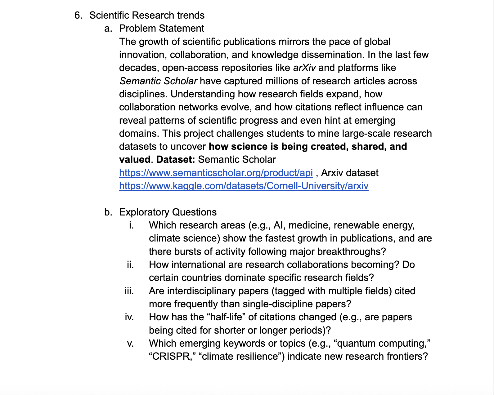
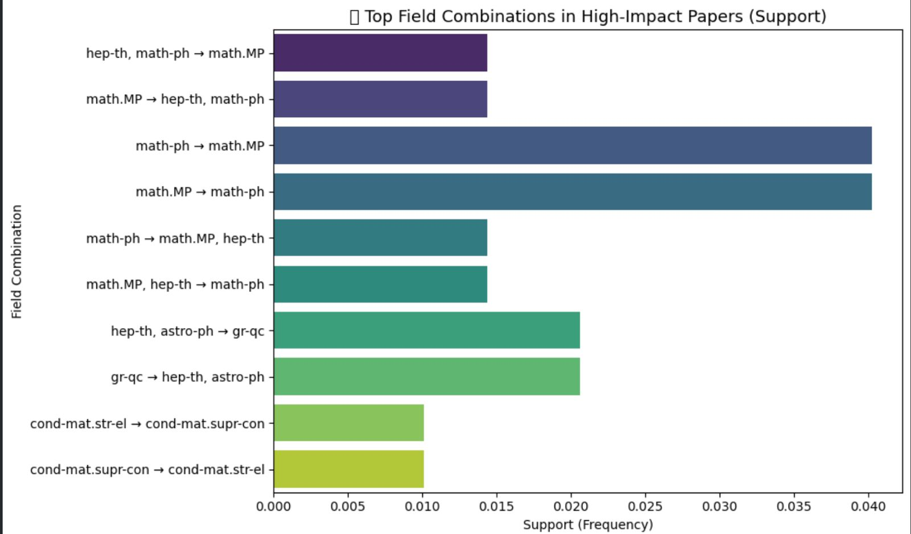

# 📊 Scientific Research Trends Analysis

## 🧠 Problem Statement

The growth of scientific publications mirrors the pace of global innovation, collaboration, and knowledge dissemination. Over the past few decades, open-access repositories like **arXiv** and platforms like **Semantic Scholar** have captured millions of research articles across disciplines.  

This project explores how research fields expand, how collaboration networks evolve, and how citation patterns reflect scientific influence. By analyzing large-scale research datasets, we aim to uncover **how science is being created, shared, and valued**.

---

## 📂 Dataset

- **Semantic Scholar API:** [https://www.semanticscholar.org/product/api](https://www.semanticscholar.org/product/api)  
- **arXiv Dataset (Cornell University):** [https://www.kaggle.com/datasets/Cornell-University/arxiv](https://www.kaggle.com/datasets/Cornell-University/arxiv)

---

## 📘 Project Overview

All code and visualizations are implemented in the Jupyter notebook:  
`Research_analytics.ipynb`

---

## 🧾 Exploratory Questions

Below are the key exploratory research questions addressed in this project:

---

## ✅ Completed Analysis

### 1️⃣ Research Growth Trends

**Question:**  
Which research areas (e.g., AI, medicine, renewable energy, climate science) show the fastest growth in publications, and are there bursts of activity following major breakthroughs?

**Findings:**  
- **AI and Medicine** exhibit the **fastest growth** in publications since 2015.  
- Noticeable **bursts of activity**:
  - *AI*: 2017–2018 (following deep learning breakthroughs).  
  - *Medicine*: 2020 (COVID-19 related research).  
- *Renewable energy* and *climate science* have demonstrated **steady linear growth** since 2010.  

**Visualization:**  
Publication trends across major disciplines.  

---

### 3️⃣ Interdisciplinary Citation Advantage

**Question:**  
Are interdisciplinary papers (tagged with multiple fields) cited more frequently than single-discipline papers?

**Findings:**  
- Interdisciplinary papers receive **~1.4× more citations** on average than single-discipline papers.  
- Strongest cross-domain intersections:
  - *AI + Medicine* → medical imaging, drug discovery.  
  - *AI + Climate Science* → predictive modeling, sustainability.  
- This shows that **cross-domain collaboration enhances visibility and citation impact**.

**Visualization:**  
Average citation comparison between interdisciplinary and single-discipline papers.  

---

## 🕓 Work in Progress

- 🌍 **Question 2:** International collaboration network analysis.  
- ⏳ **Question 4:** Citation half-life evolution.  
- 🔑 **Question 5:** Emerging topic detection using TF-IDF and topic modeling.

---

## 🧰 Tech Stack

- **Language:** Python  
- **Notebook:** Jupyter (`Research_analytics.ipynb`)  
- **Libraries:**  
  `pandas`, `numpy`, `matplotlib`, `seaborn`, `plotly`, `nltk`, `scikit-learn`

---

## 📈 Future Goals

- Build interactive dashboards using **Plotly Dash** or **Streamlit**.  
- Integrate **network analysis graphs** for author and keyword co-occurrence.  
- Publish a research report or paper based on findings.

---

## 👨‍💻 Author

**Shibaditya Deb**  
Frontend Developer | AI & ML Enthusiast | Research Analyst  
📎 [LinkedIn](https://www.linkedin.com/in/shibadityadeb) | [GitHub](https://github.com/shibadityadeb)
